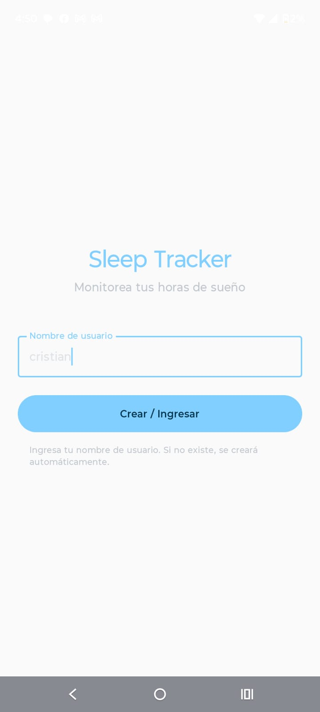
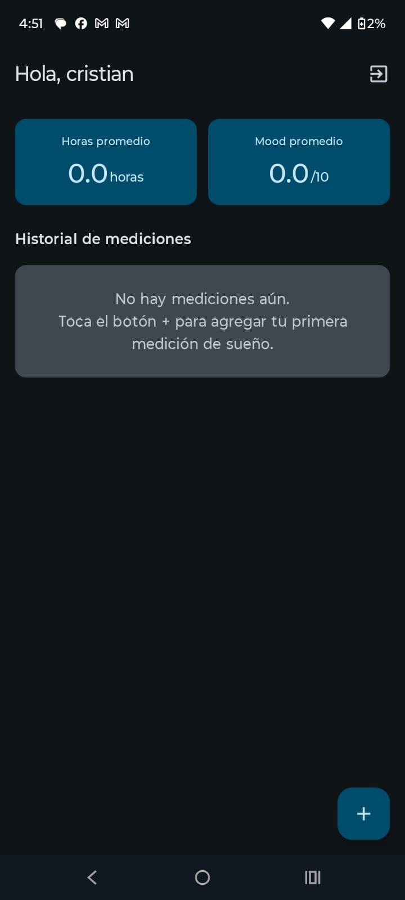
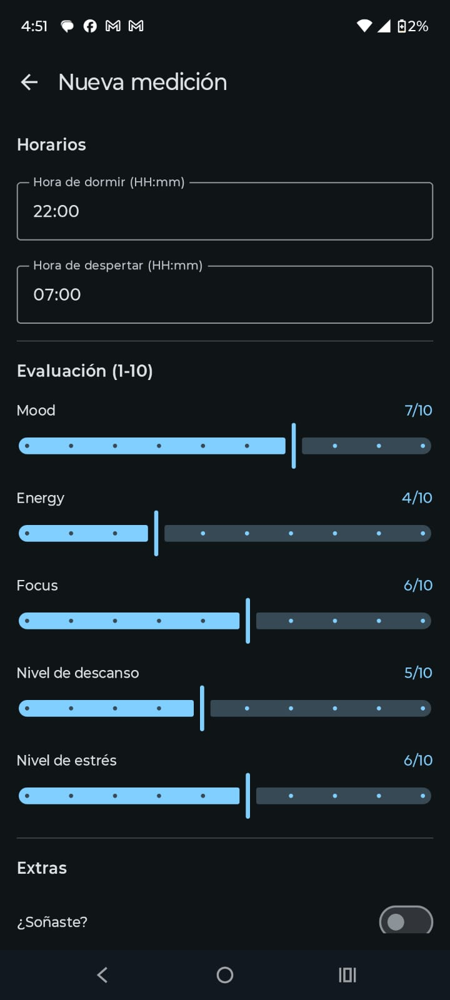
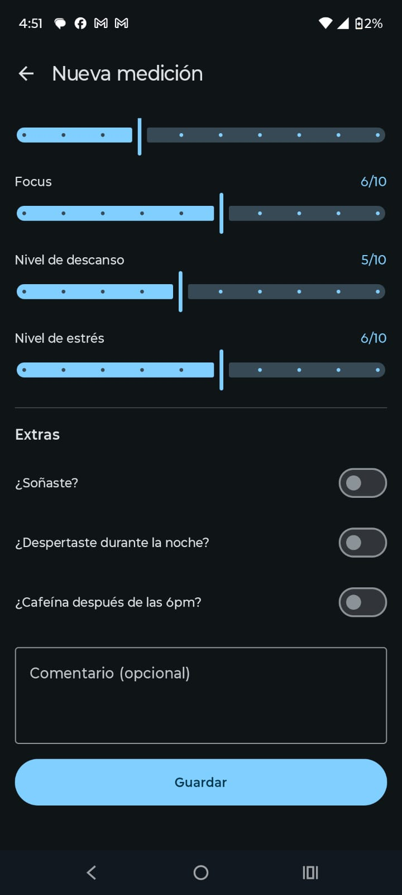
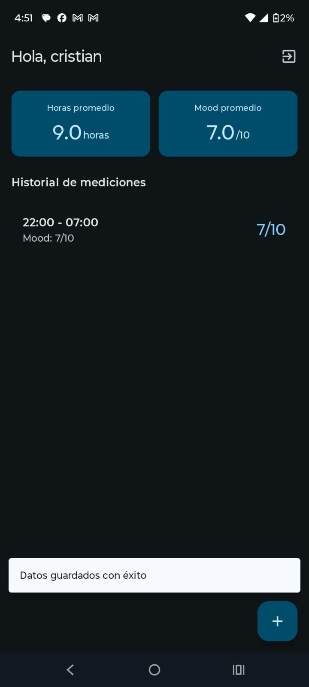

# Prueba técnica – App de monitoreo de sueño

Aplicación para monitorear datos sobre el sueño de los usuarios. Permite registrar y consultar métricas de sueño (duración, calidad, etc.) asociadas a usuarios, con un backend en Spring Boot (Kotlin) y una app móvil Android con Jetpack Compose.

<table>
  <tr>
    <td></td>
    <td></td>
  </tr>
  <tr>
    <td></td>
    <td></td>
  </tr>
  <tr>
    <td></td>
    <td></td>
  </tr>
</table>

## Stack tecnológico

- **Backend:** Spring Boot 4, Kotlin, JPA/Hibernate, MariaDB
- **App móvil:** Android, Kotlin, Jetpack Compose

---

## Estructura del proyecto

```
prueba-tecnica-springboot/
├── backend/                    # API REST Spring Boot
│   ├── src/main/kotlin/com/ccubillos/prueba/
│   │   ├── PruebaApplication.kt
│   │   ├── controllers/        # Controladores REST (User, SleepData)
│   │   ├── dto/                # DTOs de request/response
│   │   ├── models/             # Entidades JPA (User, SleepData)
│   │   ├── repository/         # Repositorios JPA
│   │   ├── services/           # Lógica de negocio
│   │   └── utils/              # Utilidades
│   └── src/main/resources/
│       └── application.properties
├── frontend/                   # App Android (Jetpack Compose)
│   └── app/src/main/java/com/example/sleep_data_app/
│       ├── data/               # API (Retrofit), modelos, repositorios
│       ├── ui/                 # Pantallas, ViewModels, navegación, tema
│       └── util/               # Utilidades (ej. PreferencesManager)
├── docker-compose.yml          # MariaDB para desarrollo
└── README.md
```

---

## Requisitos previos

- **Backend:** JDK 17, Gradle (wrapper incluido)
- **App Android:** Android Studio, SDK 24+, JDK 11
- **Base de datos:** Docker (para levantar MariaDB)

---

## 1. Levantar MariaDB con Docker

En la raíz del proyecto:

```bash
docker compose up -d
```

Esto crea el contenedor `demo-tecnica-mariadb` con:

| Parámetro        | Valor    |
|------------------|----------|
| Puerto host      | `12345` (mapeado al 3306 interno) |
| Base de datos    | `db`     |
| Usuario          | `dev`    |
| Contraseña       | `dev123` |
| Root password    | `root123`|

Para ver logs: `docker compose logs -f mariadb`  
Para detener: `docker compose down`

---

## 2. Ejecutar el backend Spring Boot

Desde el directorio `backend/`:

```bash
cd backend
./gradlew bootRun
```

O con variables de entorno explícitas (recomendado si no usas un perfil que las defina):

```bash
SPRING_DATASOURCE_URL=jdbc:mariadb://localhost:12345/db \
SPRING_DATASOURCE_USERNAME=dev \
SPRING_DATASOURCE_PASSWORD=dev123 \
./gradlew bootRun
```

La API quedará disponible en **http://localhost:8080**.

El `application.properties` usa `spring.jpa.hibernate.ddl-auto=create`, así que el esquema se crea al arrancar contra la base `db`.

---

## 3. Ejecutar la app Android (Jetpack Compose)

1. Abre el proyecto en **Android Studio**: carpeta `frontend/`.
2. Configura la URL del backend: en `app/src/main/java/.../data/api/NetworkModule.kt` la constante `BASE_URL` apunta por defecto a una IP local. Cámbiala según tu entorno:
   - **Emulador:** `http://10.0.2.2:8080/`
   - **Dispositivo físico:** `http://<IP_de_tu_PC>:8080/` (misma red que el móvil).
3. Conecta un dispositivo o inicia un emulador.
4. Ejecuta la app: **Run** (▶) o `./gradlew installDebug` desde `frontend/`:

```bash
cd frontend
./gradlew installDebug
```

---

## Resumen de pasos

1. `docker compose up -d` (en la raíz).
2. `cd backend && ./gradlew bootRun` (con las variables de BD si hace falta).
3. Abrir `frontend/` en Android Studio, ajustar `BASE_URL` en `NetworkModule.kt` y lanzar la app en dispositivo o emulador.
